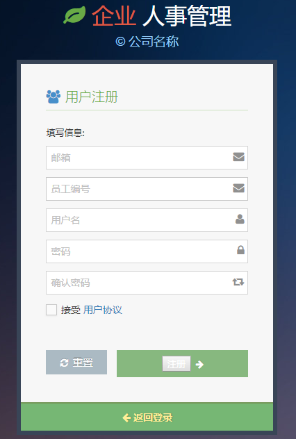

# CompanyManagement
A company management system designed when studying database in sophomore year.There seemed to be a lot of flaws today. However, as the first system I designed, I decided to save them for later improvements.
## 主要功能 ##
实现公司管理，具体包括部门管理、人员管理、项目管理及分配等。
## 开发工具 ##
PHP＋Mysql+Apache服务器
 
## 实现功能 ##
1. 注册账户
2. 登陆账户
3. 三种角色界面
4. 部门、员工、项目等信息按角色权限增删改查
5. 权限管理
## 待开发内容 ##
1. 员工之间的互相通信
2. 业绩报告
## 部分设计 ##
1. 系统功能结构图 

2. ER图 

## 系统展示 ##
1. 登陆界面 

2. 注册界面 

3. 登陆后操作主页 

4. 添加操作 

5. 权限管理 

## Thanks ##
Thanks for the suggestion of improvement

